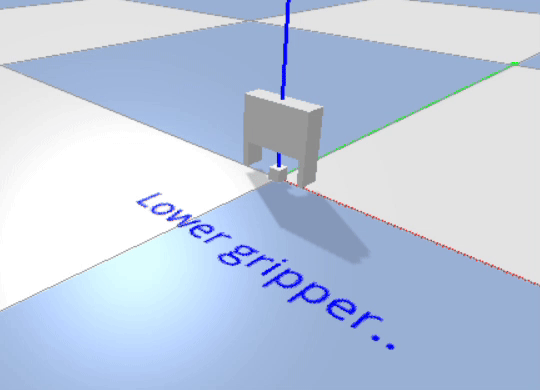
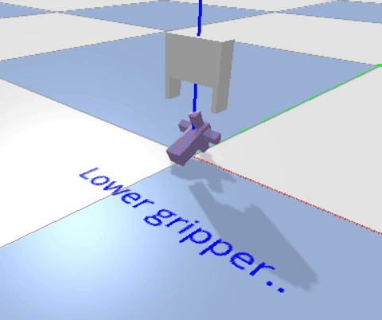
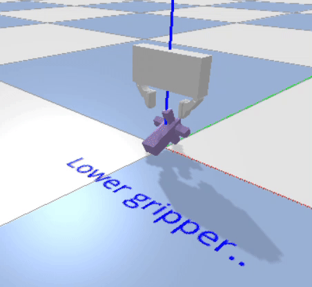

# GraspEvaluationWithPyBullet

## Overview

Gripper grasp evaluation with PyBullet.

## Videos

### Base model

#### Grasp a cube

#### Grasp random object 012

### Finger model

#### Grsp random object 012

